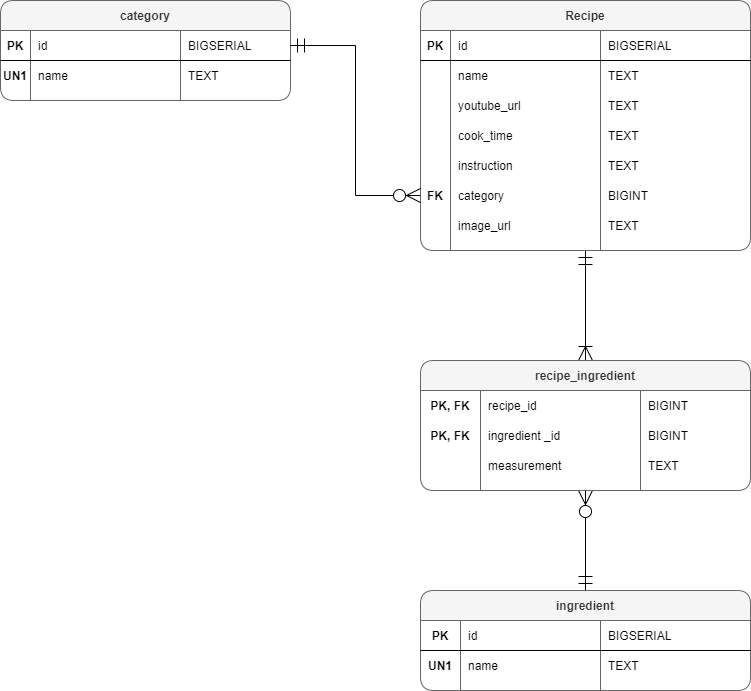

# Filipino Recipe API
Collection of recipes cooked and prepared in the philippines
Technologies used :
- Spring boot
- Spring security
- Spring data
- PostgreSQL

## Access to the API
All request to the api begin with:

```
https://filipino-recipe.herokuapp.com
```
visit the site to learn more about the methods. 

for swagger documentation:

```
https://filipino-recipe.herokuapp.com/swagger-ui/
```

## Sample recipe response format
```json
{
  "recipe": {
    "id": 1,
    "name": "some recipe",
    "category": "some category",
    "youtubeUrl": "www.youtube.com",
    "cookTime": "1 hour",
    "instruction": [
      "instruction 1",
      "instruction 2"
      
    ],
    "ingredients": [
      "ingredient1",
      "ingredient2"
    ],
    "measurements": [
      "ingredient1 measurement",
      "ingredient2 measurement"
    ],
    "imageUrl": "image url"
  }
}
```
## Entity diagram



